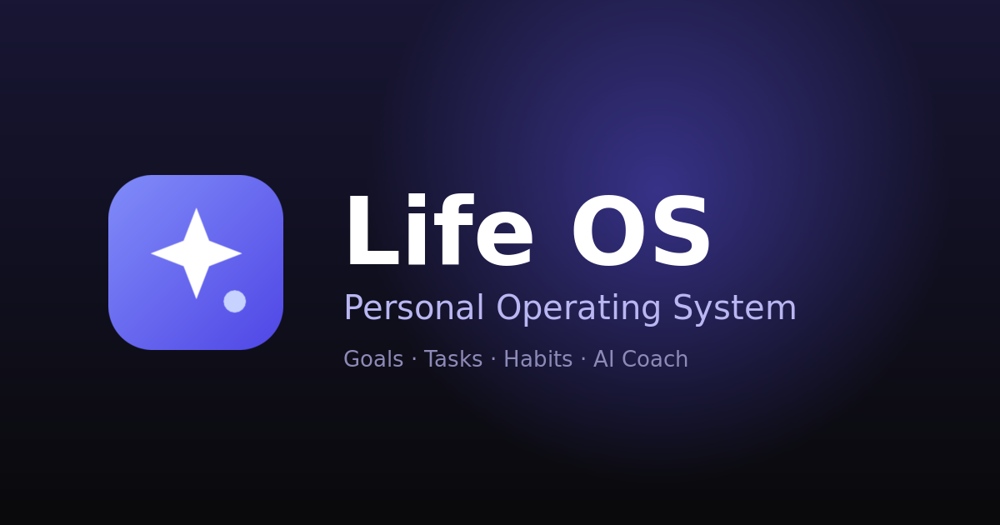

# Life OS — Personal Operating System

Plan your day, track goals, tasks and habits, and get AI coaching — in one calm, fast, bilingual (فارسی RTL / English) interface.



## Stack

- **Vite + React 19 + TypeScript**, Tailwind CSS v4 (class-based dark mode), Framer Motion, react-router
- **Persistence** — dual-mode backend:
  - **Local-first** by default (per-user data in `localStorage`, SHA-256-hashed credentials) — zero configuration.
  - **Supabase** when env vars are present (GoTrue auth incl. Google OAuth + Postgres via PostgREST), implemented dependency-free in `src/lib/supabase.ts`.
- **AI Coach** (`claude-sonnet-4-5` by default), graceful ladder:
  1. `POST /api/coach` — Vercel serverless route using server-side `ANTHROPIC_API_KEY` (never exposed to the client).
  2. **BYOK** — user pastes their own Anthropic key in Coach → Settings (stored only in their browser, sent only to `api.anthropic.com`).
  3. Smart **local engine** as offline fallback, driven by the same live context summary.

## Environment variables

| Variable | Where | Purpose |
|---|---|---|
| `ANTHROPIC_API_KEY` | Vercel env (server-only) | Enables `/api/coach` — live Claude for every user |
| `ANTHROPIC_MODEL` | Vercel env (optional) | Override model (default `claude-sonnet-4-5`) |
| `VITE_SUPABASE_URL` | Vercel env (build-time) | Activates Supabase auth + database |
| `VITE_SUPABASE_ANON_KEY` | Vercel env (build-time) | Supabase public anon key |
| `VITE_GOOGLE_CLIENT_ID` | Vercel env (build-time) | Real client-side Google sign-in via Google Identity Services |

> `VITE_*` vars are baked into the static bundle at **build time** — after adding them in Vercel, trigger a redeploy.

## Supabase setup (5 minutes)

1. Create a project at supabase.com → Settings → API: copy **Project URL** and **anon public key** into the env vars above.
2. SQL editor → run:

```sql
create table if not exists public.lifeos_data (
  id uuid primary key references auth.users(id) on delete cascade,
  data jsonb not null default '{"goals":[],"tasks":[],"habits":[],"logs":{},"chat":[]}',
  updated_at timestamptz not null default now()
);
alter table public.lifeos_data enable row level security;
create policy "own data" on public.lifeos_data
  for all using (auth.uid() = id) with check (auth.uid() = id);
```

3. **Google OAuth**: Authentication → Providers → enable *Google* (paste Google Cloud OAuth client ID/secret), then Authentication → URL Configuration → add your site URL (`https://<your-app>.vercel.app`) and redirect URL to the allow-list.

### Admin dashboard (/admin) + error logs

4. SQL editor → run once (creates the issues table with **admin-only read RLS**):

```sql
create table if not exists public.error_logs (
  id bigint generated always as identity primary key,
  created_at timestamptz not null default now(),
  user_id uuid,
  email text,
  message text not null,
  source text not null default 'client',
  path text,
  status int
);
alter table public.error_logs enable row level security;

-- any signed-in user may append errors ...
create policy "authenticated insert" on public.error_logs
  for insert to authenticated with check (true);

-- ... but only admins can read them
create policy "admin read" on public.error_logs
  for select to authenticated
  using (coalesce((auth.jwt() -> 'app_metadata' ->> 'is_admin')::boolean, false));
```

5. **Make your own account admin** (replace the email with yours):

```sql
update auth.users
set raw_app_meta_data = coalesce(raw_app_meta_data, '{}'::jsonb) || '{"is_admin": true}'
where email = 'you@example.com';
```

Then **log out and back in** (the flag lives in the JWT claims, so the token must refresh). `app_metadata` is only writable with the service role / dashboard, so regular users cannot self-promote — and the RLS policy above enforces the same claim at the database, so a non-admin calling PostgREST directly receives **zero rows**.

6. For the users directory + signup chart (GoTrue admin API), add `SUPABASE_SERVICE_ROLE_KEY` as a **server-only** Vercel env var (same project → Settings → API → `service_role` secret). Without it, `/api/admin/users` returns 503 and nothing else; errors + activity still work.

Server-side enforcement lives in `api/admin/errors.ts` and `api/admin/users.ts`: both verify the caller's JWT against Supabase and require `app_metadata.is_admin === true` **before** touching data, then use the caller's own token for DB reads so RLS is an independent second gate.

Without these vars the app simply runs in local mode — nothing breaks.

### Google sign-in (two real paths, plus a labeled demo)

1. **Supabase mode** — when the Supabase vars are set, the Google button runs the real OAuth redirect flow (enable the Google provider + redirect URL as above).
2. **Static-GIS mode** — with only `VITE_GOOGLE_CLIENT_ID` set, the button opens Google's own account chooser popup (Google Identity Services token client), and the session is created from the **verified Google profile** (name, email, avatar) returned by Google's `userinfo` endpoint. Returning Google accounts get their data back (accounts are keyed by email). Setup: Google Cloud Console → Credentials → *Create OAuth client ID* (type **Web application**) → add your site origin to **Authorized JavaScript origins** → paste the ID as `VITE_GOOGLE_CLIENT_ID` → redeploy.
3. **Demo** — with neither configured, the button creates a clearly-labeled local demo account.

## AI Coach

- Server route: `api/coach.ts` — validates input, clamps history, calls `api.anthropic.com` with the env key. The client falls through gracefully on non-200 responses.
- The coach always receives a compact **live context** block (`serializeContext` — open/overdue tasks, habit streaks & 14-day rates, goal progress & days left, last-7-day completions) inside the system prompt, and answers in the user's active language.
- Users without a server key can paste a personal `sk-ant-…` key in the coach settings (labeled BYOK). Every assistant message shows its source: *Claude · server key*, *Claude · your key*, or *Local engine*.

## Develop & build

```bash
npm install
npm run dev        # local dev
npm run build      # typecheck + production build
npm run preview    # serve the built app
```

## Internationalization

Persian is the primary locale: true `dir="rtl"` mirroring (logical CSS properties only), Vazirmatn typeface, Persian digits, and a **Jalali calendar** (month grid + week views) computed through calendar-aware `Intl` — Saturday week start. English flips to LTR with Inter + Gregorian calendar.

## Repo layout

```
api/coach.ts           Vercel serverless route (Claude proxy)
src/lib/store.tsx      session + data store (Supabase ⇄ local dual-mode)
src/lib/supabase.ts    GoTrue + PostgREST lite client
src/lib/ai.ts          Claude call ladder (server route → BYOK)
src/lib/coach.ts       live-context serializer, prompts, local smart engine
src/lib/dates.ts       ISO helpers + Jalali/Gregorian month grids
src/components/        layout, coach panel, forms, heatmap, UI primitives
src/pages/             Auth, Dashboard, Goals, Tasks, Habits, Calendar
```
